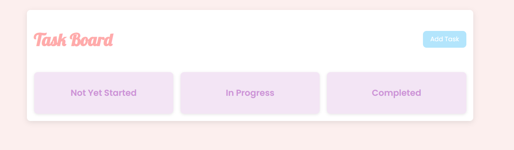
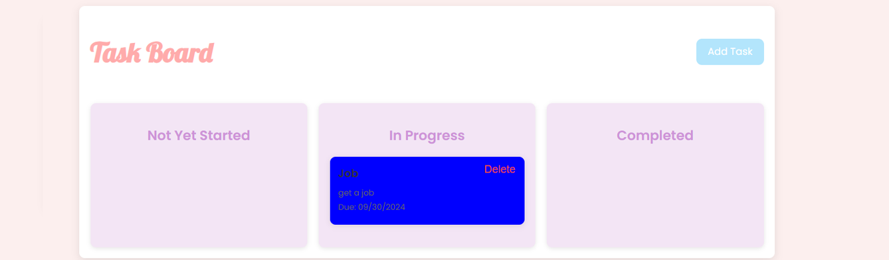

Task Board Application
##Overview
The Task Board Application is a simple tool that helps users manage tasks. Users can add tasks, organize them into columns based on progress (Not Yet Started, In Progress, Completed), and track deadlines. The app uses jQuery, jQuery UI, and day.js for smooth interaction and date management.

##Features
Add Tasks: Users can create tasks with a title, description, and deadline.

Task Management: Tasks are categorized into three columns based on their progress:

Not Yet Started
In Progress
Completed
Drag and Drop: Users can move tasks between columns by dragging and dropping them to update their status.

Task Deletion: Users can remove tasks when they're no longer needed.

Color Coding: Tasks are color-coded based on their status and deadlines to provide a clear visual indication of urgency:

White (Not Yet Started): The task still has more than 3 days remaining before the deadline.
Red: The task is past its due date.
Blue (In Progress): The task is currently being worked on, and the deadline is more than 3 days away.
Yellow: The task's deadline is approaching (within 3 days) or it is marked as "In Progress" with a nearing deadline.
Green: The task has been completed.
Technologies Used
jQuery: For DOM manipulation and handling events.
jQuery UI: To enable drag-and-drop functionality.
day.js: For handling and formatting dates.
LocalStorage: For saving tasks across sessions, ensuring tasks persist even after refreshing the page.

##How to Use
Load the App:

Open index.html in your browser.
Add a Task:

Click the "Add Task" button.
Fill in the form with a title, description, and deadline, then click "Save Task."
Manage Tasks:

Drag and drop tasks between columns to update their status (Not Yet Started, In Progress, Completed).
Delete tasks when they are no longer needed by clicking the "Delete" button.
Persistent Storage:

Tasks are automatically saved in LocalStorage, meaning they will persist after refreshing the page or reopening the browser.

For any questions, please contact me with the information below:

GitHub: erinspix
Email: e.spix@yahoo.com
application link: https://erinspix.github.io/challenge-task-board/
## Images
Task Board Page

task board with task

